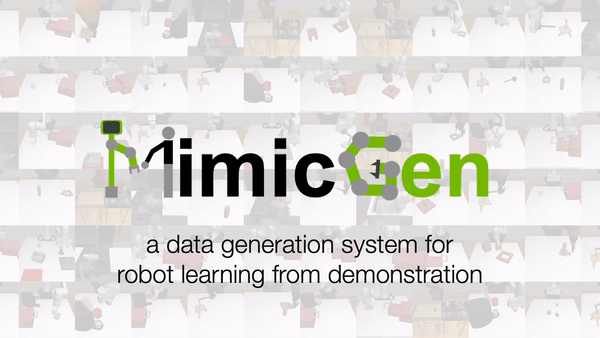

# MimicGen

### commands
1. python mimicgen/scripts/generate_dataset.py --config /tmp/core_configs_og/demo_src_test_tiago_single_arm_cup_task_D1.json --auto-remove-exp --num_demos 2 --bimanual --seed 1 --video_path tiago_single_arm_cup

2. python mimicgen/train_scripts/train_prep_data.py --file_path /tmp/core_datasets_og/test_tiago_single_arm_cup/demo_src_test_tiago_single_arm_cup_task_D1/demo_failed.hdf5 --output_path datasets/generated_data/test_tiago_single_arm_cup/robomimic_dataset_D1_ds.hdf5 --split_ratio 0.5 --num_pcd_samples 4096 --fps --vis_sign --with_color

3. python mimicgen/train_scripts/train_mimicgen.py --mg_config mimicgen/train_scripts/mg_configs/demo_src_test_tiago_cup_task_D1.json --config mimicgen/train_scripts/train_configs/tiago_D1_jpos_colorPCD_lr0001_b128_ds.json

<p align="center">
  
</p>

This repository contains the official release of data generation code, simulation environments, and datasets for the [CoRL 2023](https://www.corl2023.org/) paper "MimicGen: A Data Generation System for Scalable Robot Learning using Human Demonstrations". 

The released datasets contain over 48,000 task demonstrations across 12 tasks and the MimicGen data generation tool can create as many as you'd like.

Website: https://mimicgen.github.io

Paper: https://arxiv.org/abs/2310.17596

Documentation: https://mimicgen.github.io/docs/introduction/overview.html

For business inquiries, please submit this form: [NVIDIA Research Licensing](https://www.nvidia.com/en-us/research/inquiries/)

-------
## Latest Updates
- [07/09/2024] **v1.0.0**: Full code release, including data generation code
- [04/04/2024] **v0.1.1**: Dataset license changed to [CC-BY 4.0](https://creativecommons.org/licenses/by/4.0/), which is less restrictive (see [License](#license))
- [09/28/2023] **v0.1.0**: Initial code and paper release

-------

## Useful Documentation Links

Some helpful suggestions on useful documentation pages to view next:

- [Getting Started](https://mimicgen.github.io/docs/tutorials/getting_started.html)
- [Launching Several Data Generation Runs](https://mimicgen.github.io/docs/tutorials/launching_several.html)
- [Reproducing Published Experiments and Results](https://mimicgen.github.io/docs/tutorials/reproducing_experiments.html)
- [Data Generation for Custom Environments](https://mimicgen.github.io/docs/tutorials/datagen_custom.html)
- [Overview of MimicGen Codebase](https://mimicgen.github.io/docs/modules/overview.html)

## Troubleshooting

Please see the [troubleshooting](https://mimicgen.github.io/docs/miscellaneous/troubleshooting.html) section for common fixes, or submit an issue on our github page.

## License

The code is released under the [NVIDIA Source Code License](https://github.com/NVlabs/mimicgen/blob/main/LICENSE) and the datasets are released under [CC-BY 4.0](https://creativecommons.org/licenses/by/4.0/).

## Citation

Please cite [the MimicGen paper](https://arxiv.org/abs/2310.17596) if you use this code in your work:

```bibtex
@inproceedings{mandlekar2023mimicgen,
    title={MimicGen: A Data Generation System for Scalable Robot Learning using Human Demonstrations},
    author={Mandlekar, Ajay and Nasiriany, Soroush and Wen, Bowen and Akinola, Iretiayo and Narang, Yashraj and Fan, Linxi and Zhu, Yuke and Fox, Dieter},
    booktitle={7th Annual Conference on Robot Learning},
    year={2023}
}
```
